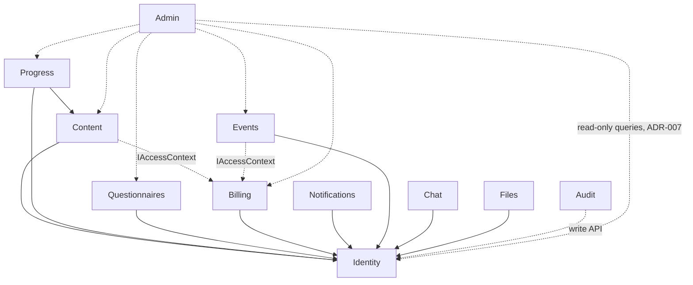
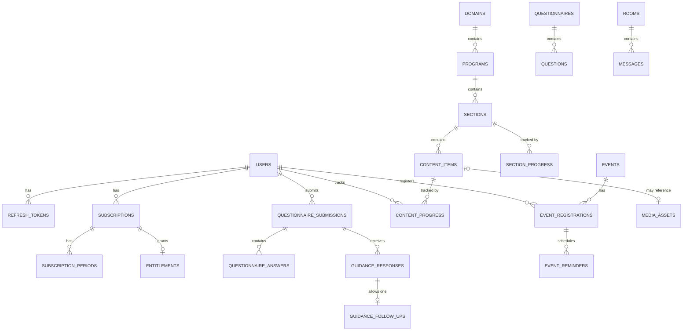
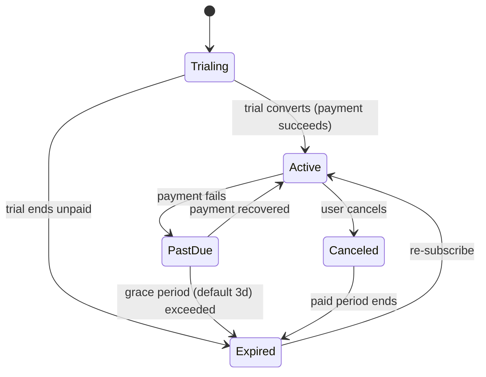
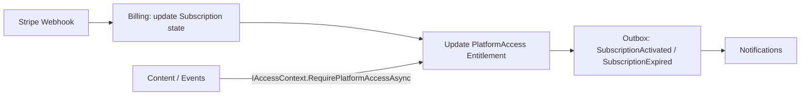
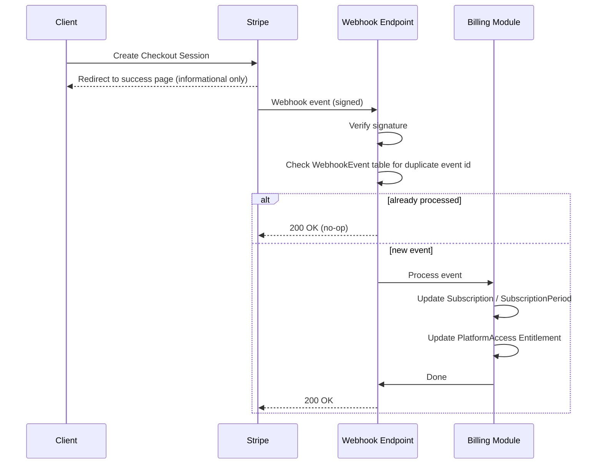
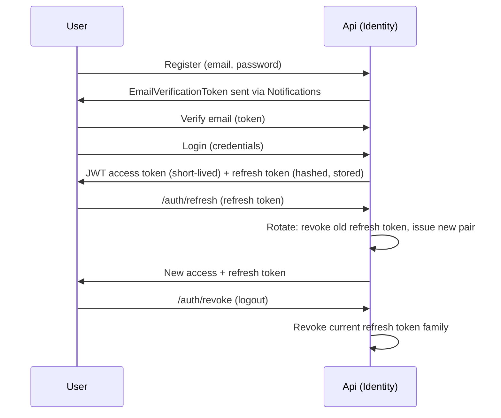
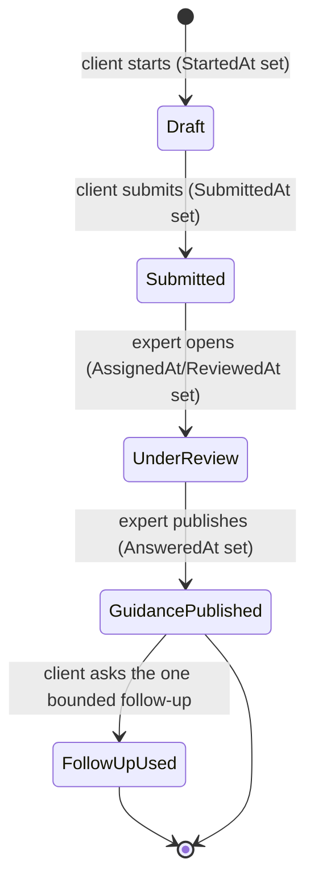
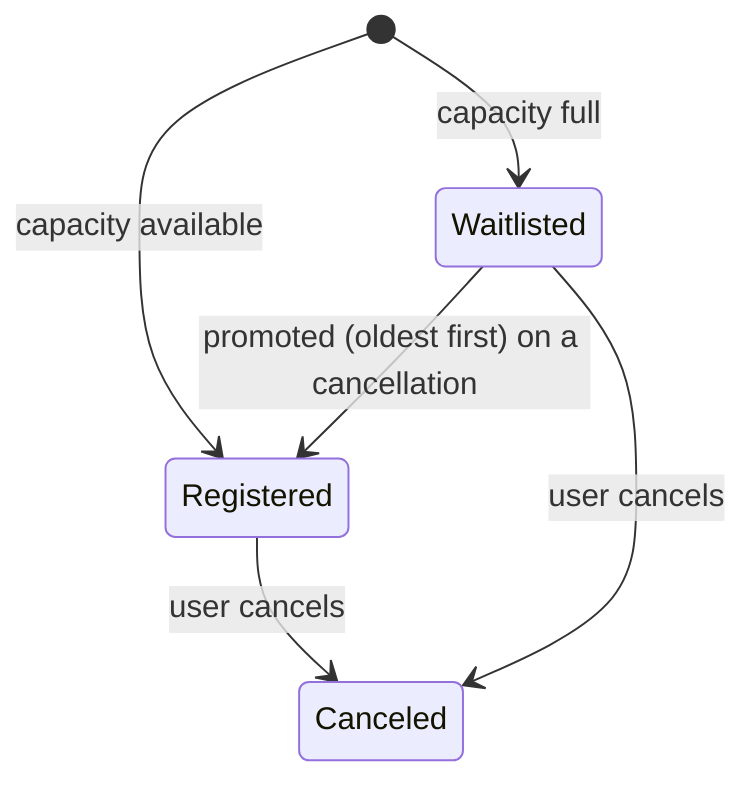

# B-United — Architecture (Phase 0 deliverable)

Consolidates the required pre-implementation architecture output (PROMPT.md
§74) and precedes the mandatory architecture review (§75, see
[Architecture Review](#12-architecture-review-§75) below). This document is
derived from [`PROMPT.md`](PROMPT.md); it does not introduce new scope.

Status: **draft, pending explicit approval** (P0.32). No Phase 1 production
code should start until this is signed off.

---

## 1. Executive overview

B-United V1 is a single-organization, single-expert, subscription-based
personal development platform. One ASP.NET Core modular monolith, one
PostgreSQL database, one React SPA. Five content domains (Psychology,
Sport, Nutrition, Business, Financial Education) share one generic content
engine — no per-domain logic. Personalization is delivered through
expert-authored written guidance, not dynamic content generation. Target
scale: ~2,000 subscribers, ~200 concurrent users (§67) — this rules out
premature distributed infrastructure (ADR-001).

Top architectural risks (expanded in §13):

1. `Entitlement` generality vs the single V1 `PlatformAccess` need.
2. SignalR real-time chat as a schedule risk in Phase 6.
3. "Encryption at rest where feasible" is under-specified and could block Phase 4.
4. `SectionProgress` denormalization needs an explicit, transactional recalculation rule.

## 2. Module map + ownership table

| Module | Owns | Depends on (Contracts only) |
|---|---|---|
| Identity | User, Role, Permission, RefreshToken, verification/reset tokens, UserConsent, UserPreference | — |
| Content | Domain, Program, Section, ContentItem, MediaAsset (+ translations) | Identity, Billing (`IAccessContext`) |
| Progress | ContentProgress, SectionProgress | Identity, Content |
| Questionnaires | Questionnaire, Question(Option), Submission, Answer, GuidanceResponse, GuidanceFollowUp (+ translations) | Identity |
| Billing | Plan(Price), Subscription(Period), PaymentCustomer, Payment, Invoice, WebhookEvent, Entitlement | Identity |
| Notifications | Email dispatch abstraction, notification preferences read | Identity |
| Events | Event(Translation), EventRegistration, EventReminder | Identity, Billing (`IAccessContext`) |
| Chat | Room (fixed), Message, Report, Mute | Identity |
| Files | Object-storage abstraction for non-video assets | Identity |
| Audit | AuditLog | — (write API consumed by all modules) |
| Admin | Read-only cross-module projections only (owns no writable entities) | Identity, Billing, Progress, Content, Questionnaires, Events, Chat (read-only) |

## 3. Allowed dependency map



Solid arrows = Contracts-layer dependency. Dotted = either the narrow
`IAccessContext` interface or an explicitly allowed read-only projection
(ADR-007). No module depends on another module's Domain or Infrastructure
layer. No cycles.

## 4. Domain event map (transactional outbox, §13)

| Event | Producer | Consumer(s) | Why outbox (not sync call) |
|---|---|---|---|
| `SubscriptionActivated` | Billing | Notifications | Email delivery can fail/retry independently of the webhook transaction |
| `SubscriptionExpired` | Billing | Notifications | Same — delivery guarantee matters |
| `PaymentFailed` | Billing | Notifications | Same |
| `QuestionnaireSubmitted` | Questionnaires | Notifications | Expert must be notified even if email provider is briefly down |
| `GuidancePublished` | Questionnaires | Notifications | Same |
| `EventPublished` | Events | Notifications (future: subscriber digest) | Delivery guarantee |
| `EventRegistrationCreated` | Events | Notifications | Confirmation email must not be lost |

Everything else (e.g. Progress recalculation, reorder operations) is a
direct in-process call — no outbox, per §13's "do not use domain events for
every trivial synchronous call."

## 5. Database schema (by module)

Full column-level detail lives in `PROMPT.md` §14–38; this is the
cross-reference table used to drive migrations.

| Module | Tables |
|---|---|
| Identity | `users`, `roles`, `permissions`, `role_permissions`, `user_roles`, `refresh_tokens`, `email_verification_tokens`, `password_reset_tokens`, `user_consents`, `user_preferences` |
| Content | `domains`, `programs`, `program_translations`, `sections`, `section_translations`, `content_items`, `content_item_translations`, `media_assets` |
| Progress | `content_progress`, `section_progress` |
| Questionnaires | `questionnaires`, `questionnaire_translations`, `questions`, `question_translations`, `question_options`, `question_option_translations`, `questionnaire_submissions`, `questionnaire_answers`, `guidance_responses`, `guidance_follow_ups` |
| Billing | `plans`, `plan_prices`, `subscriptions`, `subscription_periods`, `payment_customers`, `payments`, `invoices`, `webhook_events`, `entitlements` |
| Events | `events`, `event_translations`, `event_registrations`, `event_reminders` |
| Chat | `rooms`, `messages`, `reports`, `mutes` |
| Audit | `audit_logs` |

Naming: snake_case table/column names (PostgreSQL convention), English
only (§4). All money columns `decimal` + explicit currency (§63). All
timestamp columns UTC (§64).

## 6. ER relationship overview



Cross-module references (e.g. `Subscription.UserId` → `Identity.User`) are
by ID only — no cross-module foreign keys enforced at the database level,
consistent with module ownership (§12).

## 7. Key indexes

- Every foreign key column listed in §5 is indexed (mandatory, §62).
- `users.email` — unique index.
- `subscriptions.user_id`, `subscriptions.status` — lookup for entitlement checks and admin filtering.
- `webhook_events.provider_event_id` — unique index (idempotency).
- `questionnaire_submissions.status`, `questionnaire_submissions.submitted_at` — expert queue ordering.
- `event_registrations.event_id, user_id` — unique composite (one registration per user per event).
- `content_progress.user_id, content_item_id` — unique composite.
- `messages.room_id, created_at` — pagination.
- No index is added without a query pattern from §7 backing it (reject mechanical indexing, per §62).

## 8. Subscription state machine



Access allowed: `Trialing`, `Active`, `PastDue` (within grace period).
Access denied: `Expired`, `PastDue` (past grace period). `Canceled` keeps
access until the paid period ends, then transitions to `Expired`.

## 9. Entitlement flow



Billing is the only writer of `Entitlement` rows. All other modules read
through `IAccessContext` — never query the `entitlements` table directly.

## 10. Payment webhook sequence



## 11. Authentication / token lifecycle



## 12. Permission matrix

| Permission | Client | Expert | Administrator |
|---|:---:|:---:|:---:|
| `content.view` | ✅ | ✅ | ✅ |
| `content.create` | | ✅ | ✅ |
| `content.edit` | | ✅ | ✅ |
| `content.publish` | | ✅ | ✅ |
| `questionnaire.submit` | ✅ | | |
| `questionnaire.review` | | ✅ | |
| `questionnaire.answer` | | ✅ | |
| `events.view` | ✅ | ✅ | ✅ |
| `events.manage` | | ✅ | ✅ |
| `chat.use` | ✅ | ✅ | ✅ |
| `chat.moderate` | | ✅ | ✅ |
| `billing.view` | own only | own only | all |
| `billing.manage` | | | ✅ |
| `users.manage` | | | ✅ |
| `audit.view` | | | ✅ |

Roles are convenience groups seeded with these grants (P1.16–P1.17);
authorization checks always test the permission claim, never the role
string (§14).

## 13. Questionnaire lifecycle



Waiting-time buckets for the expert queue (computed server-side, §27):
`< 24h` normal, `24–48h` attention, `> 48h` overdue.

## 14. Progress calculation rules

- `ContentProgress` (video): auto-complete at ≥90% watched; position persisted every ~15s plus on pause/navigate/close/complete.
- `ContentProgress` (rich text): completed only via explicit "Mark as completed".
- `SectionProgress`: denormalized, recalculated **synchronously in the same transaction** as the triggering `ContentProgress` write (see review item R4, §15) — not via an async/outbox event, since this stays inside one module.
- Program-level progress: **derived at read time** from `SectionProgress`/`ContentProgress`; no persisted `ProgramProgress` table unless load testing (P7.12) proves it necessary.

## 15. Event registration / waitlist state machine



Registration is blocked entirely once `StartsAtUtc` has passed, and always
requires `IAccessContext.RequirePlatformAccessAsync`.

## 16. Localization architecture

Two independent systems (ADR-004):

- **UI localization** — i18next/react-i18next, lazy-loaded namespaces, source-controlled JSON under `frontend/src/locales/{ro,en}`. Never hardcoded in components.
- **Content localization** — dedicated `*Translation` tables per translatable entity (Program, Section, ContentItem, Event, Question, QuestionOption, Questionnaire). Each parent entity has a `DefaultLanguage`. Missing translation → return default-language content + `translationFallbackUsed: true` in admin DTOs only; client-facing DTOs never expose the flag, they just silently fall back.

## 17. Sensitive-data strategy

- Questionnaire submissions and guidance are visible only to the submitting client and the assigned expert — never to Administrators by default (§35).
- Consent is captured and versioned before first questionnaire access (`UserConsent`).
- Questionnaire content is excluded from logs, analytics events, and notification bodies.
- Sensitive reads (`questionnaire.read`) are audited with metadata only (no content).
- No automated clinical-risk classification anywhere — crisis handling is static, localized safety copy plus a manual reporting/escalation path (§36).
- Encryption at rest: see review item R3 (§15) for the recommended, de-scoped Phase 4 approach.

## 18. Audit strategy

`AuditLog { Id, ActorUserId, Action, EntityType, EntityId, TimestampUtc, CorrelationId, IpAddress?, Metadata }`.
Actions audited per §37 (auth events, subscription lifecycle, webhook
processing, questionnaire submit/read, guidance publish, content publish,
event publish/cancel, chat moderation). `Metadata` is schema-validated at
the write API boundary to reject tokens/secrets/questionnaire text.

## 19. Frontend route map

| Route | Access | Notes |
|---|---|---|
| `/` (Home/Dashboard) | Auth required | §41 |
| `/programs`, `/programs/:slug` | Auth + `PlatformAccess` | §42–43 |
| `/programs/:slug/player` | Auth + `PlatformAccess` | §44 |
| `/events`, `/events/:id` | Auth (view), `PlatformAccess` (register) | §29–31 |
| `/community/:room` | Auth + `PlatformAccess` | §33 |
| `/guidance` | Auth + `PlatformAccess` | §25–28 |
| `/billing` | Auth | works even without active access |
| `/profile` | Auth | |
| `/admin/*` | Auth + relevant permission per screen | §45–54 |

Route guards are UX only — every access decision is re-checked server-side
(§65, DEVELOPMENT_INSTRUCTIONS.md §6).

## 20. Client UI information architecture

Nav: Home → Programs → Events → Community → My Guidance → Billing →
Profile (§40). Mobile priority: Home, Programs, Events, Community, Profile
in a bottom nav. Dashboard hierarchy: Continue card → Guidance status →
Progress overview → Upcoming event → Community activity (§41).

## 21. Expert/admin UI information architecture

Nav: Dashboard → Programs → Questionnaires → Events → Community →
Subscribers → Billing → Notifications → Audit → Settings (§45). Dashboard
leads with items needing action (pending queue, oldest unanswered,
reported messages) over vanity KPIs (§46).

## 22. Design-system tokens

Categories: `Background/Surface/SurfaceRaised`, `BorderDefault/BorderStrong`,
`TextPrimary/Secondary/Muted`, `Primary/PrimaryHover`,
`Success/Warning/Danger/Info`, plus spacing/typography/radius/shadow
scales, breakpoints, focus ring, motion timing (§56). Implemented as
Tailwind config + CSS variables in Phase 1 (P1.29). No component may use
an arbitrary color/spacing value outside these tokens.

## 23. Responsive rules

Breakpoints: Mobile / Tablet / Laptop-Desktop (§58). Management tables
convert to stacked cards/condensed rows/drawers on mobile — never a
horizontally shrunk table. Minimum touch target 44px.

## 24. API contract overview

Base path `/api/v1/{auth,users,programs,progress,questionnaires,events,chat,billing,admin}`
(§60). Standard error contract:

```json
{ "code": "SUBSCRIPTION_INACTIVE", "messageKey": "errors.subscriptionInactive", "correlationId": "..." }
```

Validation errors add a `field`-level `errors[]` array (§61). Pagination:
`page`/`pageSize` query params, `{items, total, page, pageSize}` response
envelope (defined at Phase 1 implementation time, kept consistent across
all list endpoints).

## 25. Background-job catalogue (Hangfire)

| Job | Trigger | Idempotency key |
|---|---|---|
| Event reminder (24h) | Scheduled per event start | `EventReminder` sent-flag |
| Event reminder (1h) | Scheduled per event start | `EventReminder` sent-flag |
| Subscription grace-period sweep | Recurring (hourly) | Subscription state is the guard — re-running is a no-op once `Expired` |
| Outbox dispatcher | Recurring (short interval) | Outbox message processed-flag |

## 26. Testing strategy

Highest-risk areas get the deepest coverage (§68, DEVELOPMENT_INSTRUCTIONS.md §9):
Billing (webhook idempotency/out-of-order/grace period/cancellation/
re-subscription), Entitlements (every state), Security (permission,
cross-user, questionnaire privacy), Questionnaires (lifecycle, bounded
follow-up), Localization (fallback), Events (capacity/waitlist/timezone),
Progress (resume/threshold/manual completion). See `docs/TASKS.md` `*.Tests`
subsections per phase for the concrete test list.

## 27. Deployment architecture

Single Api host container + PostgreSQL container, orchestrated via Docker
Compose for local/staging; same image promoted to production with
environment-specific configuration (§9, §67). Video and email are external
providers reached over HTTPS — never proxied through the app server for
video bytes. Backups: PostgreSQL automated backup + documented restore
drill (P7.18).

## 28. Phase-by-phase backlog

See [`docs/TASKS.md`](TASKS.md) — 8 phases, ~262 parent tasks, each broken
into concrete lettered subtasks. This architecture document must stay in
sync with Phase 0's task list (P0.01–P0.29) as those items are produced.

## 29. Architectural risks and trade-offs register

| Risk | Likelihood | Impact | Mitigation |
|---|---|---|---|
| Generic `Entitlement` schema over-built for a single V1 entitlement type | Medium | Low | See review R1 — trim to `PlatformAccess`-shaped columns now |
| SignalR integration slips Phase 6 schedule | Medium | Medium | See review R2 — timebox + polling fallback |
| "Encryption at rest where feasible" blocks Phase 4 delivery | Medium | High | See review R3 — de-scope to infra-level encryption + strict access control for V1 |
| `SectionProgress` drifts from `ContentProgress` if recalculated async | Low | Medium | See review R4 — synchronous, same-transaction recalculation |
| Video provider vendor lock-in | Low | Low | Provider abstraction (`IVideoProvider`, ADR-005) keeps the switch cost bounded |
| Single-expert bottleneck in questionnaire review queue | Medium (business risk, not technical) | Medium | Out of architecture scope — flagged for product ownership, not mitigated in code |

---

## Architecture Review (§75)

Per §75, the architecture must be actively challenged before approval —
not accepted merely because it appears in the prompt.

### R1 — `Entitlement` generality vs. the single V1 need

- **Issue:** §15 defines a generic `Entitlement` shape (`Type`, `SourceType`, `SourceId`, `ValidFrom/Until`, `Status`) even though V1 has exactly one entitlement (`PlatformAccess`).
- **Why it matters:** Unused generality (`Type`/`SourceType`/`SourceId`) adds columns, nullability decisions, and index questions with zero current consumer — the kind of speculative flexibility §71 explicitly warns against.
- **Recommended change:** Ship the V1 table with only the columns `PlatformAccess` actually needs (`Id, UserId, ValidFrom, ValidUntil, Status`). Add `Type`/`SourceType`/`SourceId` in a later migration only when a second entitlement type is real.
- **Trade-off:** A future second entitlement type requires a migration instead of an empty-column no-op — acceptable, since migrations are already a normal, expected activity in this codebase (§72).

### R2 — SignalR as a Phase 6 schedule risk

- **Issue:** §33 mandates SignalR "if implementation remains straightforward" with polling as fallback, but doesn't bound how long to try before falling back.
- **Why it matters:** Open-ended technical spikes are a classic source of schedule slip, and Chat is explicitly the phase allowed to move post-launch (§69) — an unbounded SignalR effort could consume that buffer for a non-critical feature.
- **Recommended change:** Timebox the SignalR spike (e.g. 2 working days) at the start of Phase 6. If a working hub with room-scoped broadcast isn't running by then, ship polling for V1 and file a post-launch follow-up.
- **Trade-off:** Polling is less responsive and slightly more server load at low volume (~200 concurrent users, well within budget per §67) — an acceptable UX cost for schedule certainty.

### R3 — "Encryption at rest where feasible" is under-specified

- **Issue:** §35 requires "encryption at rest for questionnaire responses and guidance where feasible" without naming a mechanism, and §35 also explicitly defers legal classification of the data.
- **Why it matters:** Column-level application encryption (EF value converters, key rotation, loss of server-side searchability) is real engineering effort that could block Phase 4's actual deliverable (expert-led guidance workflow) chasing a requirement whose legal necessity isn't yet confirmed.
- **Recommended change:** Phase 4 ships with strict access control (P4.15), audit (P4.17), TLS in transit, and the hosting provider's disk-level encryption at rest as the baseline. Treat column-level application encryption as a separate, explicitly-scoped follow-up once legal classification (§35) is confirmed — captured as a new ADR item, not silently dropped.
- **Trade-off:** Slightly less defense-in-depth on day one; avoided risk of over-building a control the business may not legally require, and avoided blocking the phase's core deliverable.

### R4 — `SectionProgress` recalculation timing is unspecified

- **Issue:** §24 says `SectionProgress` "may remain denormalized" and recalculation "should be deterministic," but doesn't say whether recalculation is synchronous or event-driven.
- **Why it matters:** If recalculation is treated as an async/outbox concern (by analogy with §13's other event usage), dashboards can show stale section-completion state, which directly affects the client dashboard's Continue card (§41) — a core UX moment.
- **Recommended change:** Recalculate `SectionProgress` synchronously, in the same database transaction as the triggering `ContentProgress` write. This stays entirely inside the Progress module — it is not a cross-module event and doesn't need the outbox.
- **Trade-off:** Slightly larger transaction on each progress update; negligible at the target scale (§67) and removes an entire class of stale-dashboard bugs.

### Disposition

R1–R4 are recommended as accepted changes to the Phase 0 baseline (folded
into §5, §14, §29 above). No blocking issues were found in the overall
modular-monolith / single-database / Contracts-boundary approach — it is
appropriately sized for the stated scale and business model.

**Approved (P0.32) on 2026-08-08 by the project owner (alexflorian98@gmail.com).** R1–R4 are accepted as-is; the R3 encryption-at-rest deferral is recorded in [ADR-009](adr/ADR-009-Data-At-Rest-Encryption-Scope.md). Phase 1 implementation may begin.
